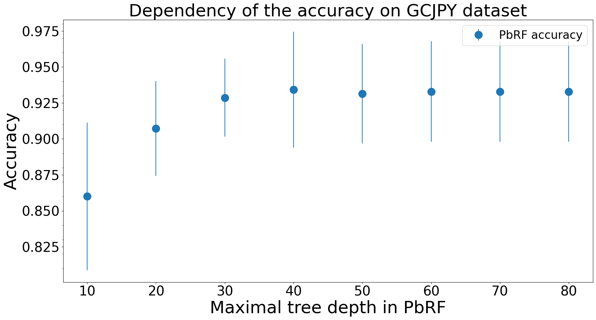

# Hyperparameters

Dependency of models' accuracy on their hyperparameters.

## PbRF

#### Maximal tree depth, GCJ, C++, 1600 developers

#### Maximal tree depth, GCJ, Python, 70 developers

#### Maximal tree depth, Java-40, 40 developers

#### Number of features after MI selection, GCJ, C++, 1600 developers

#### Number of features after MI selection, GCJ, Python, 70 developers

#### Number of features after MI selection, Java-40, 40 developers

#### Number of trees, GCJ, C++, 1600 developers

#### Number of trees, GCJ, Python, 70 developers

#### Number of trees, Java-40, 40 developers

 
#### Path length, GCJ, C++, 1600 developers

#### Path length, GCJ, Python, 70 developers

#### Path length, Java-40, 40 developers

 
## PbNN

#### Dimensionality of the embeddings, GCJ, C++, 1600 developers

#### Dimensionality of the embeddings, GCJ, Python, 70 developers

#### Dimensionality of the embeddings, Java-40, 40 developers

 

 
