# Authorship detection
The goal of this project is evaluation of a [code2vec](https://code2vec.com/)\-based approach for authorship identification 
and exploring/solving issues of the existing datasets for authorship attribution of source code.

## Papers used for comparision
* [De-anonymizing Programmers via Code Stylometry](https://www.usenix.org/system/files/conference/usenixsecurity15/sec15-paper-caliskan-islam.pdf) |
[source code](https://github.com/calaylin/CodeStylometry)
* [Source Code Authorship Attribution using LSTM Based Networks](https://www.cs.drexel.edu/~greenie/stylometry-esorics.pdf) |
[source code](https://github.com/balsulami/stylemotery)
* [Authorship attribution of source code by using back propagation neural network based on particle swarm optimization](https://journals.plos.org/plosone/article/file?id=10.1371/journal.pone.0187204&type=printable) | 
source code not available
## Datasets
* Google Code Jam submissions, C/C++/Python
* [40 authors](https://github.com/xinyu1118/authorship_attribution), Java
* Projects mined from GitHub with a new data collection approach

The Java, C++, and Python datasets are also available [here](https://drive.google.com/drive/u/1/folders/1UGFFC5KYMRA-9F_VTsG_VcsZjAv7SG4i).

## Project structure
Data extraction pipeline consists of two modules: [Gitminer](attribution/gitminer) written in Python and [Pathminer](attribution/pathminer) written in Kotlin. 
* Gitminer processes history of Git repository to extract all the blobs containing Java code.
* Pathminer uses [GumTree](https://github.com/GumTreeDiff/gumtree) to parse Java code and track method changes through repo's history.
* To extract data from GitHub projects, store names and links of GitHub projects in [projects](attribution/projects.txt) and
[git_projects](attribution/git_projects.txt), respectively. Then, go to [runner directory](attribution/runner) and run `run.py`

Models and all the code for training/evaluation located in [authorship_pipeline](attribution/authorship_pipeline) directory.
To run experiments:
* Create configuration file manually (for examples see [configs](attribution/authorship_pipeline/configs) directory) or 
edit and run `generate_configs.py`.
* Run `python run_classification.py configs/path/to/your/config.yaml`
* To draw graphs for evaluation on your project run `draw_graphs.py --project your_project_name`

To run cross-validation on new data:
* Put source code files in `datasets/datasetName/{author}/{files}`. Make sure files of each author are in a single directory. 
* Run data extraction to mine path-contexts from the source files:
```
java -jar attribution/pathminer/extract-path-contexts.jar snapshot \
    --project datasets/datasetName/ \
    --output processed/datasetName/ \
    --java-parser antlr \
    --maxContexts 2000 --maxH 8 --maxW 3
```
* Depending on the language, extracted data will be in the `processed/datasetName/{c,cpp,java,py}` folder.
* To run cross-validation, create a configuration file (e.g., 
[PbNN](attribution/authorship_pipeline/configs/java40/nn) or 
[PbRF](attribution/authorship_pipeline/configs/java40/rf))) 
and run `python -m run_classification path/to/config` in `attribution/authorship_pipeline` folder.

## Results

### [IntelliJ Community](https://github.com/jetbrains/intellij-community)

#### 44 developers, 2000 to 10000 samples each (context separation)

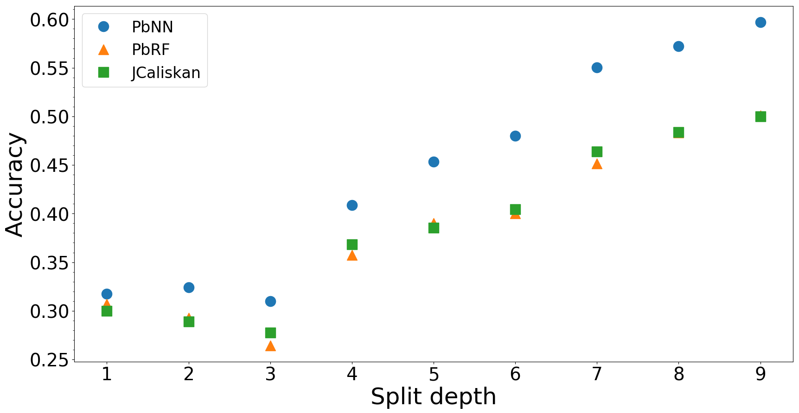

#### 44 developers, 2000 to 10000 samples each (time separation)

##### PbNN

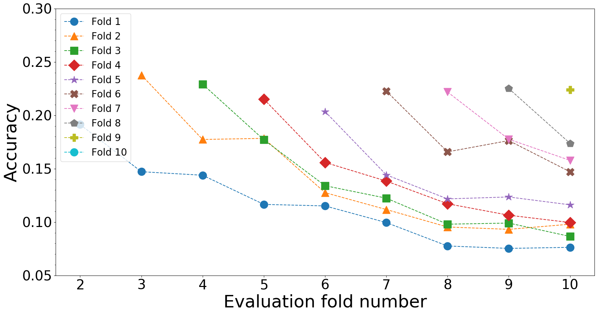

##### PbRF

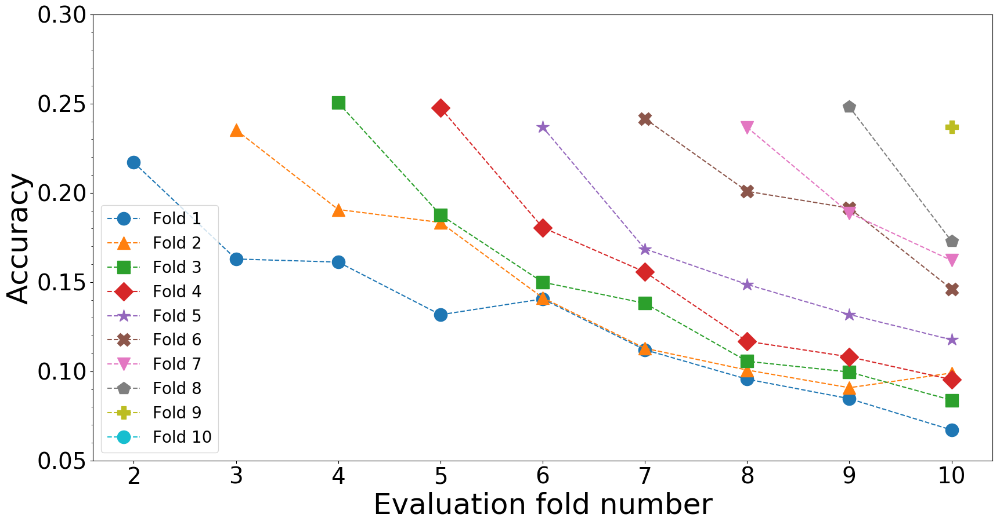

##### JCaliskan

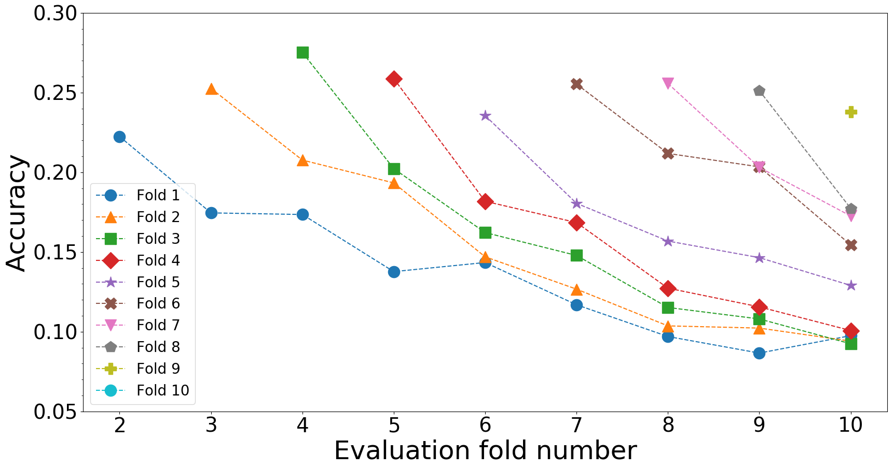

#### 21 developers, at least 10000 samples each (context separation)

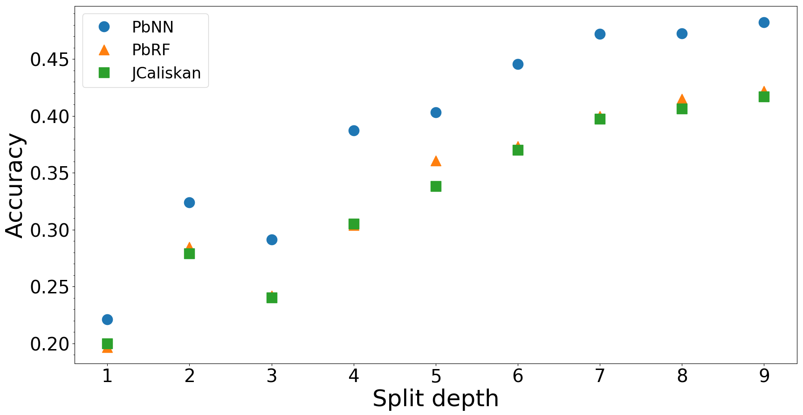

#### 21 developers, at least 10000 samples each (time separation)

##### PbNN

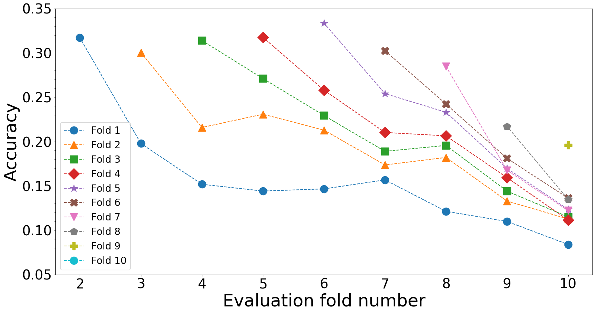

##### PbRF

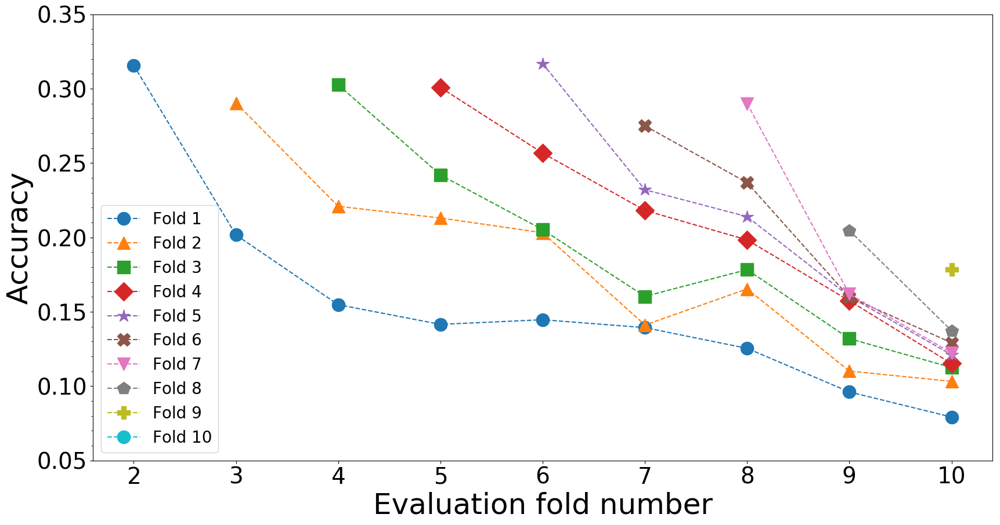

##### JCaliskan

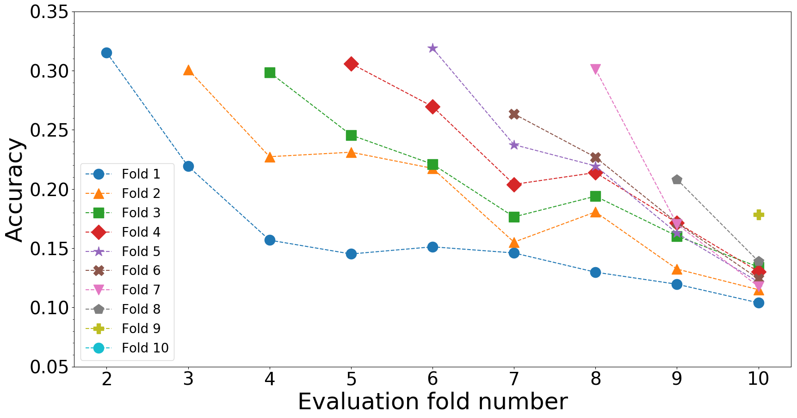

### [Gradle](https://github.com/gradle/gradle)

#### 28 developers, at least 500 samples each (context separation)

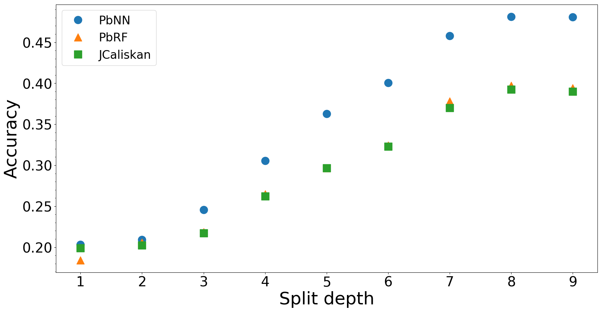

#### 28 developers, at least 500 samples each (time separation)

##### PbNN

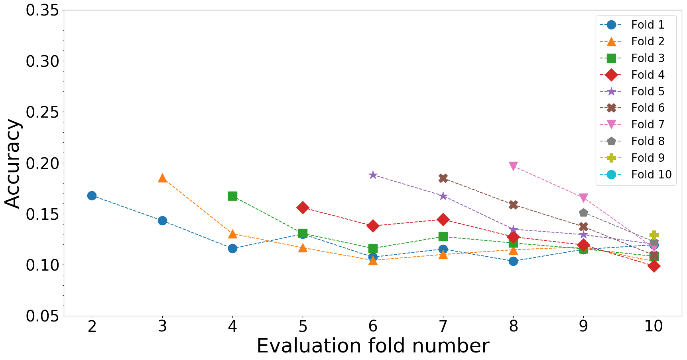

##### PbRF

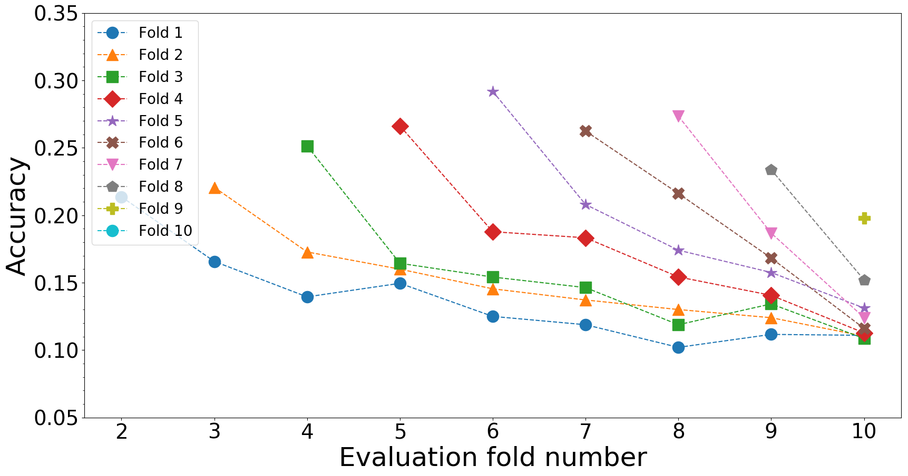

##### JCaliskan

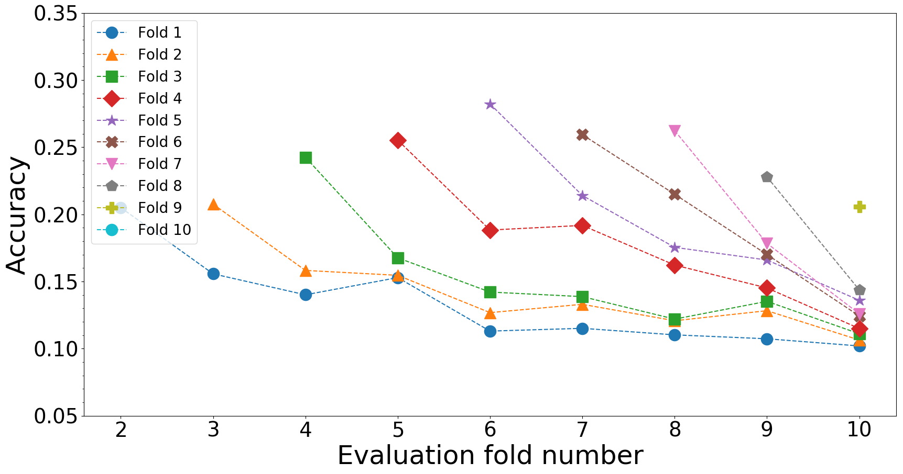

### [Mule](https://github.com/mulesoft/mule)

#### 16 developers, 1000 to 5000 samples each (context separation)

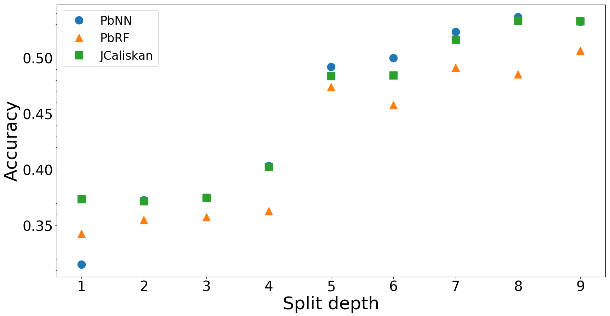

#### 7 developers, at least 5000 samples each (context separation)

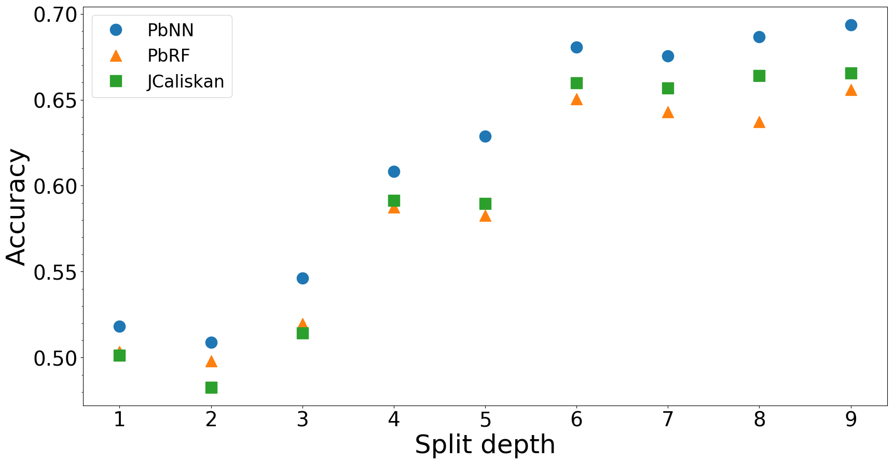

